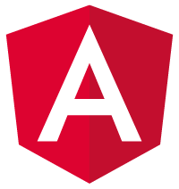
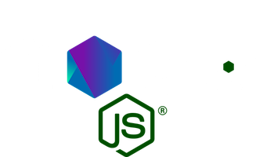

# Building a MEAN app with Angular 2

## Jussi Kinnula

@jussikinnula on Twitter

---


# MEAN

http://mean.io

___

# MEAN =






___


MongoDB is the leading NoSQL database, empowering businesses to be more agile and scalable.

___


Express is a minimal and flexible node.js web application framework, providing a robust set of features for building single and multi-page, and hybrid web applications.

___


AngularJS lets you extend HTML vocabulary for your application. The resulting environment is extraordinarily expressive, readable, and quick to develop.

___


Node.js is a platform built on Chrome's JavaScript runtime for easily building fast, scalable network applications.

---

# Angular 2 + MEAN = ?

Originally MEAN stack was built on top of AngularJS 1.x series.

In practice, also original MEAN could be extended with TypeScript for commonly shared models and components.

___

# Angular 2 + MEAN = ?

### With Angular 2, even more is awesome:

- Angular 2 works naturally with NodeJS modules, while AngularJS 1.x required a lot of boilerplating
- Angular Universal (e.g. "server-side rendering enabled Angular 2") works well together with ExpressJS
- Common models shared between backend and frontend (TypeScript interfaces, creater classes and extended Mongoose schemas and models)

---

### Angular 2 & MEAN in action (1/12)

Here're couple of examples how Angular 2 can make MEAN app tick really well.

Code is available (as whole) under *MIT license* at: https://github.com/jussikinnula/angular2-mean-starter

___

### Angular 2 & MEAN in action (2/12)

Todo model: `src/models/todo.model.ts`

```
import * as mongoose from "mongoose";

export interface ITodo {
    created: Date;
    updated?: Date;
    title: string;
}

export interface ITodoModel extends ITodo, mongoose.Document {}
 
export var TodoSchema = new mongoose.Schema({
    created: Date,
    updated: Date,
    title: String
});

export var Todo = mongoose.model<ITodoModel>("Todo", TodoSchema);
```

___

### Angular 2 & MEAN in action (3/12)

Backend: `src/server.ts` & `src/server/app.ts`

Modular TypeScript class `src/server/app.ts` was already covered on earlier talk: https://jussikinnula.github.io/angular2-chat-20160615

___

### Angular 2 & MEAN in action (4/12)

REST API: `src/server/rest.ts`

```
import * as express from "express";

import { RestDefault, RestTodo } from "./rest/index";

export class Rest {
    router: express.Router;

    constructor() {
        this.router = express.Router();
        this.config();
    }

    private config(): void {
        this.todo();
        this.default();
    }

    private todo(): void {
        let restTodo = new RestTodo();

        // List todos
        this.router.get("/todo", (
            request: express.Request,
            response: express.Response
        ) => restTodo.list(request, response));

        // Create todo
        this.router.post("/todo", (
            request: express.Request,
            response: express.Response
        ) => restTodo.create(request, response));

        // Find a todo
        this.router.get("/todo/:todo", (
            request: express.Request,
            response: express.Response
        ) => restTodo.find(request, response));

        // Delete a todo
        this.router.put("/todo/:todo", (
            request: express.Request,
            response: express.Response
        ) => restTodo.update(request, response));

        // Delete a todo
        this.router.delete("/todo/:todo", (
            request: express.Request,
            response: express.Response
        ) => restTodo.remove(request, response));
    }

    private default(): void {
        // Default route
        let restDefault = new RestDefault();
        this.router.get("*", (
            request: express.Request,
            response: express.Response
        ) => restDefault.request(request, response));
    }
}
```

___

### Angular 2 & MEAN in action (5/12)

Todo controller: `src/server/rest/todo.ts`

```
import * as express from "express";

import { ITodo, Todo, ITodoModel } from "../../models";

export class RestTodo {
    constructor() {}

    list(
        request: express.Request,
        response: express.Response
    ): any {
        Todo.find({}).exec(
            (error: any, todos: ITodoModel[]) => {
                return response.send({
                    todos: todos || []
                });
            }
        );
    }

    create(
        request: express.Request,
        response: express.Response
    ): any {
        let data = [];
        request.on("data", chunk => {
            data.push(chunk);
        }).on("end", () => {
            let todoString = Buffer.concat(data).toString();
            let todo: ITodo = todoString
                ? JSON.parse(todoString)
                : {};
            todo.created = new Date();
            Todo.create(todo, (error: any, todo: ITodoModel) => {
                if (todo) {
                    return response.send(todo);
                } else {
                    return response.status(400).send({ 
                        success: false, 
                        message: "Invalid parameters" 
                    });
                }
            });
        });
    }

    find(
        request: express.Request,
        response: express.Response
    ): any {
        const id = request.params["todo"];
        if (id) {
            Todo.findById(id).exec(
                (error: any, todo: ITodoModel) => {
                    if (todo) {
                        return response.send(todo);
                    } else {
                        return response.status(404).send({ 
                            success: false, 
                            message: "Todo not found" 
                        });
                    }
                }
            );
        } else {
            response.status(400).send({
                success: false,
                message: "Bad request" 
            });
        }
    }

    update(
        request: express.Request,
        response: express.Response
    ): any {
        const id = request.params["todo"];
        if (id) {
            let data = [];
            request.on("data", chunk => {
                data.push(chunk);
            }).on("end", () => {
                let todoString = Buffer.concat(data).toString();
                let todoUpdated: ITodo = todoString
                    ? JSON.parse(todoString)
                    : {};
                Todo.findById(id).exec(
                    (error: any, todo: ITodoModel) => {
                        if (todo) {
                            todo.updated = new Date();
                            if (todoUpdated.title) {
                                todo.title = todoUpdated.title;
                            }
                            todo.save();
                            return response.send(todo);
                        } else {
                            return response.status(404).send({ 
                                success: false, 
                                message: "Todo not found" 
                            });
                        }
                    }
                );
            });
        } else {
            response.status(401).send({
                success: false,
                message: "Unauthorized" 
            });
        }
    }

    remove(
        request: express.Request,
        response: express.Response
    ): any {
        const id = request.params["todo"];
        if (id) {
            Todo.findById(id).exec(
                (error: any, todo: ITodoModel) => {
                    if (todo) {
                        todo.remove();
                        return response.send({ 
                            success: true, 
                            message: "Todo removed sucessfully" 
                        });
                    } else {
                        return response.status(404).send({ 
                            success: false, 
                            message: "Todo not found" 
                        });
                    }
                }
            );
        } else {
            response.status(400).send({
                success: false,
                message: "Bad request" 
            });
        }
    }
}
```

___

### Angular 2 & MEAN in action (6/12)

Entry point for frontend: (`src/client.ts`)

```
import { enableProdMode } from "@angular/core";
import { platformBrowserDynamic }
    from "@angular/platform-browser-dynamic";

// App module
import { AppModule } from "./client/app";

// Global styles
import "./styles/main.styl";

// Declare process variable
// (so that type checker doesn't nag about it)
declare var process;

// Production mode
if (process.env.NODE_ENV === "production") {
    enableProdMode();
}

platformBrowserDynamic().bootstrapModule(AppModule);
```

___

### Angular 2 & MEAN in action (7/12)

`src/client/app/app.module.ts`

```
import { BrowserModule  } from "@angular/platform-browser";
import { NgModule, ModuleWithProviders } from "@angular/core";
import { CommonModule } from "@angular/common";
import { FormsModule } from "@angular/forms";
import { HttpModule } from "@angular/http";

// App component
import { AppComponent } from "./app.component";

// View components
import { FrontpageView, TodoView } from "../views";

// Routing
import { routing } from "./app.routing";

// Shared pipes
import { PipesModule } from "../pipes/pipes.module";

// Shared services
import { ServicesModule } from "../services/services.module";

@NgModule({
    imports: [
        BrowserModule,
        CommonModule,
        FormsModule,
        HttpModule,
        PipesModule,
        ServicesModule,
        routing
    ],
    providers: [
        ServicesModule
    ],
    declarations: [
        AppComponent,
        FrontpageView,
        TodoView
    ],
    bootstrap: [
        AppComponent
    ]
})
export class AppModule {}
```

___

### Angular 2 & MEAN in action (8/12)

`src/client/services/services.module.ts`

```
import { NgModule, ModuleWithProviders } from "@angular/core";

import { TodoService } from "./todo.service";
import { UserService } from "./user.service";

@NgModule({
    providers: [
        TodoService,
        UserService
    ]
})
export class ServicesModule {}
```

___

### Angular 2 & MEAN in action (9/12)

`src/client/services/todo.service.ts`

```
import { Injectable } from "@angular/core";
import { Http, Response, Headers, RequestOptions }
    from "@angular/http";
import { Observable, ReplaySubject } from "rxjs";

import { ITodo } from "../../models";

@Injectable()
export class TodoService {
    todos: ReplaySubject<any> = new ReplaySubject(1);
    private list: ITodo[];
    private url: string = "/rest/todo";

    constructor(private http: Http) {
        this.listTodos();
    }

    listTodos(): void {
        this.http.get(this.url)
            .map( (response: Response) => response.json() )
            .subscribe(
                (response: any) => {
                    this.list = response.todos;
                    this.todos.next(this.list);
                },
                (error: any) => console.log(error)
            );
    }

    createTodo(todo: ITodo): void {
        let headers = new Headers({
            "Content-Type": "application/json"
        });
        let options = new RequestOptions({ headers: headers });
        this.http.post(this.url, todo, options)
            .map( (response: Response) => response.json() )
            .subscribe(
                (todo: ITodo) => this.updateOrCreateTodo(todo),
                (error: any) => console.log(error)

            );
    }

    findTodo(id: string): Observable<any> {
        return Observable.create( observer => {
            this.todos.subscribe( todos => {
                const index = this.findIndex(id);
                observer.next(todos[index]);
            });
        });
    }

    updateTodo(todo: ITodo): void {
        let headers = new Headers({
            "Content-Type": "application/json"
        });
        let options = new RequestOptions({ headers: headers });
        this.http.put(this.url + "/" + todo["_id"], todo, options)
            .map( (response: Response) => response.json() )
            .subscribe(
                (todo: ITodo) => this.updateOrCreateTodo(todo),
                (error: any) => console.log(error)
            );
    }


    removeTodo(todo: ITodo): void {
        this.http.delete(this.url + "/" + todo["_id"])
            .map( (response: Response) => response.json() )
            .subscribe(
                (success: any) => {
                    const index = this.findIndex(todo["_id"]);
                    if (index !== -1) {
                        this.list.splice(index, 1);
                        this.todos.next(this.list);
                    }
                },
                (error: any) => console.log(error)

            );
    }

    private updateOrCreateTodo(todo: ITodo) {
        const index: number = this.findIndex(todo["_id"]);
        if (index === -1) {
            // Create
            this.list.push(todo);
        } else {
            // Update
            this.list[index] = todo
        }
        this.todos.next(this.list);        
    }

    private findIndex(id: string): number {
        return this.list.findIndex((todo: ITodo) => {
            return todo["_id"] === id;
        });
    }
}
```

___

### Angular 2 & MEAN in action (10/12)

`src/client/views/todo/todo.view.ts`

```
import { Component } from "@angular/core";

import { TodoEditComponent, TodoListComponent }
    from "../../components";

declare var require;
const styles: string = require("./todo.view.styl");
const template: string = require("./todo.view.pug");

@Component({
    directives: [
        TodoEditComponent,
        TodoListComponent
    ],
    styles: [styles],
    template
})

export class TodoView {
    constructor() {}
}
```

___

### Angular 2 & MEAN in action (11/12)

TodoListComponent: `src/client/components/todo-list/todo-list.component.ts`

```
import { Component } from "@angular/core";
import { Router } from "@angular/router";

import { TodoService } from "../../services";

import { ITodo } from "../../../models";

declare var require;
const styles: string = require("./todo-list.component.styl");
const template: string = require("./todo-list.component.pug");

@Component({
    selector: "todo-list",
    styles: [styles],
    template
})

export class TodoListComponent {
    todos: ITodo[];

    constructor(public router: Router, private todoService: TodoService) {
        this.todoService.todos.subscribe( todos => this.todos = todos);
    }
}
```

___

### Angular 2 & MEAN in action (12/12)

`src/.../todo-edit/todo-edit.component.ts`

```
import { Component, OnInit } from "@angular/core";
import { ActivatedRoute, Router } from "@angular/router";

import { TodoService } from "../../services";

import { ITodo } from "../../../models";

declare var require;
const styles: string = require("./todo-edit.component.styl");
const template: string = require("./todo-edit.component.pug");

@Component({
    selector: "todo-edit",
    styles: [styles],
    template
})

export class TodoEditComponent implements OnInit {
    selected: ITodo;

    constructor(
        public route: ActivatedRoute,
        public router: Router,
        private todoService: TodoService
    ) {}

    ngOnInit() {
        this.route.params.subscribe( (params: any) => {
            const id = params["todo"];
            this.todoService
                .findTodo(id)
                .subscribe( todo => this.selected = todo );
        });
    }

    save(title: string) {
        let todo = Object.create(this.selected);
        todo.title = title;
        this.todoService.updateTodo(todo);
        this.router.navigate(["/todo"]);
    }

    remove() {
        this.todoService.removeTodo(this.selected);
        this.router.navigate(["/todo"]);
    }

    cancel() {
        this.router.navigate(["/todo"]);
    }

    create(title: string) {
        let todo: ITodo = {
            created: new Date,
            title: title
        };
        this.todoService.createTodo(todo);
    }
}
```

---


---

# "TODO"

- Add more tests (currently there's only one unit test for AppComponent creation)
- Implement pagination to REST API + frontend side
- Implenent auto-reloading / Socket.io "updates" interface to get updates (when there's multiple people editing the Todos)
- Make `NgModule`'s out of some of the reusable component, packagize them and put to *NPM* repository

---

# Thank you!

#### GitHub project:

https://github.com/jussikinnula/angular2-mean-starter


#### These slides:

https://jussikinnula.github.io/angular2-mean-20160818
