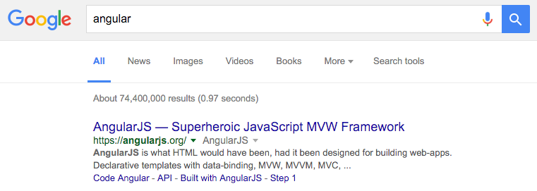
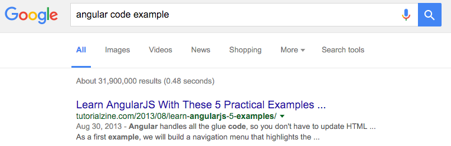

# Angular 2 & SEO

## Jussi Kinnula

https://github.com/jussikinnula/angular2-express-phantom
https://jussikinnula.github.io/angular2-seo-20160414

---

# What is SEO?

___

# Search
# Engine
# Optimization

___

## It is the process of getting traffic from the *free*, *organic*, *editorial* or *natural* search results on search engines.

___

## 1. Add page or product description

You need to have a description which gives the smalles possible level of information for search engines about your product.

___

## 2. Use words which are recognized by search engines

Google and Microsoft don't know that your page is about a code example, if you don't use *Code Example* in your titles, and explain that the examples are written in *Angular 2 Framework* for example.

___

## 3. Create unique content

Use content only on a single page or view. Do not repeat the same content all over again, of course there can be link lists, but don't repeat everything.

### For example:

* `www.company.com` ... frontpage, only links to the newest things + welcoming words
* `www.company.com/about` ... information about the company
* `www.company.com/contact` ... contact information

___

## 4. Avoid duplicating pages

Do not put the exact same pages on multiple routes. You can use router to do forwarding. Remember that a single page app has different router than is on the backend.

### You can always use a 404 page to say that the page doesn't exist.

---

# Angular 2 + ExpressJS setup

https://github.com/jussikinnula/angular2-express-phantom

---

# Deployed version

https://angular2-seo-test.herokuapp.com/

https://angular2-seo-test.herokuapp.com/?_escaped_fragment_

---

# Thank you!