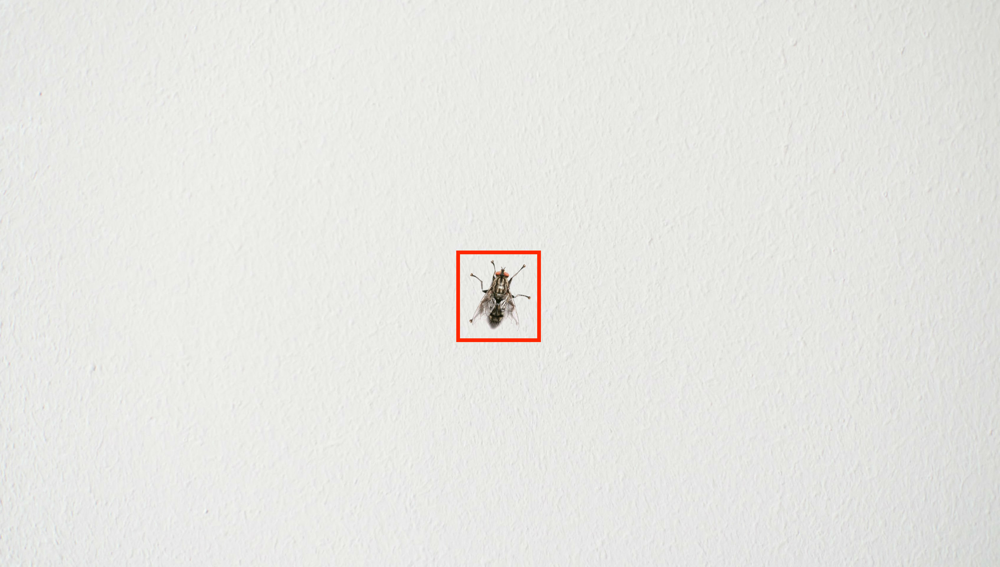

# Imager::Trim

## Jussi Kinnula

@jussikinnula on Twitter

spot@cpan.org

---

# Problem

___

## "Fly in a wall"


___

## How to select just the fly?



---

# Could I use ImageMagick?

___

### trim an image.

This option removes any edges that are exactly the same color as the corner pixels. Use `-fuzz` to make `-trim` remove edges that are nearly the same color as the corner pixels.

The page or virtual canvas information of the image is preserved allowing you to extract the result of the `-trim `operation from the image. Use a `+repage` to remove the virtual canvas page information if it is unwanted.

If the trimmed image 'disappears' ...

http://www.imagemagick.org/script/command-line-options.php#trim

___

"Image::Magick - objected-oriented Perl interface to ImageMagick. Use it to create, edit, compose, or convert bitmap images from within a Perl script.""

http://search.cpan.org/~jcristy/PerlMagick-6.89-1/Magick.pm

___

```bash
# apt-cache depends libmagickcore5
libmagickcore5
  Depends: libbz2-1.0
  Depends: libc6
  Depends: libfftw3-double3
  Depends: libfontconfig1
  Depends: libfreetype6
  Depends: libgomp1
  Depends: libjasper1
  Depends: libjbig0
  Depends: libjpeg8
  Depends: liblcms2-2
  Depends: liblqr-1-0
  Depends: libltdl7
  Depends: liblzma5
  Depends: libpng12-0
  Depends: libtiff5
  Depends: libx11-6
  Depends: libxext6
  Depends: libxml2
  Depends: zlib1g
  Depends: imagemagick-common
  PreDepends: multiarch-support
    multiarch-support:i386
  Suggests: libmagickcore5-extra
  Recommends: ghostscript
    ghostscript:i386
  Recommends: gsfonts
  Replaces: libmagickcore5:i386
  Breaks: libmagickcore5:i386
```

___

## Typically used ImageMagick dependencies

# 157 MB

___

### Pros

- The "swiss knife" of image manipulation

### Cons

- Too huge dependencies
- Hard to get dependencies on existing cloud systems (Heroku, DockerCloud, Amazon, etc) using pre-existing maintained stacks/buildpacks/toolchains

### Score

`:-(`

---

# Could I use GD?

___

http://search.cpan.org/~lds/GD-2.56/lib/GD.pm

"*GD.pm* is a Perl interface to Thomas Boutell's gd graphics library (version 2.01 or higher; see below). GD allows you to create color drawings using a large number of graphics primitives, and emit the drawings as PNG files.""

___

https://github.com/trizen/perl-scripts/blob/master/Image/img-autocrop.pl

```perl
#!/usr/bin/perl

# Author: Daniel "Trizen" Șuteu
# License: GPLv3
# Date: 14 June 2015
# http://github.com/trizen

# A generic image auto-cropper which adapt itself to any background color.

use 5.010;
use strict;
use warnings;

use GD qw();

use Getopt::Long qw(GetOptions);
use File::Basename qw(basename);
use File::Spec::Functions qw(catfile);

# Set true color
GD::Image->trueColor(1);

# Autoflush mode
local $| = 1;

my $tolerance = 5;
my $invisible = 0;

my $jpeg_quality    = 95;
my $png_compression = 7;

my $directory = 'Cropped images';

sub help {
    my ($code) = @_;
    print <<"EOT";
usage: $0 [options] [images]

options:
    -t --tolerance=i    : tolerance value for the background color
                          default: $tolerance

    -i --invisible!     : make the background transparent after cropping
                          default: ${$invisible ? \'true' : \'false'}

    -p --png-compress=i : the compression level for PNG images
                          default: $png_compression

    -j --jpeg-quality=i : the quality value for JPEG images
                          default: $jpeg_quality

    -d --directory=s    : directory where to create the cropped images
                          default: "$directory"

example:
    perl $0 -t 10 *.png
EOT
    exit($code // 0);
}

GetOptions(
           'd|directory=s'       => \$directory,
           'i|invisible!'        => \$invisible,
           't|tolerance=i'       => \$tolerance,
           'p|png-compression=i' => \$png_compression,
           'j|jpeg-quality=i'    => \$jpeg_quality,
           'h|help'              => sub { help(0) },
          )
  or die("$0: error in command line arguments!\n");

{
    my %cache;

    sub is_background {
        my ($img, $index, $bg_rgb) = @_;
        my $rgb = ($cache{$index} //= [$img->rgb($index)]);
        abs($rgb->[0] - $bg_rgb->[0]) <= $tolerance
          and abs($rgb->[1] - $bg_rgb->[1]) <= $tolerance
          and abs($rgb->[2] - $bg_rgb->[2]) <= $tolerance;
    }
}

sub check {
    my ($img, $bg_rgb, $width, $height) = @_;

    my $check = sub {
        foreach my $sub (@_) {
            is_background($img, $sub->(), $bg_rgb) || return;
        }
        1;
    };

    my $w_lt_h = $width < $height;
    my $min = $w_lt_h ? $width : $height;

    my %seen;

    # Spiral-in to smaller gaps
    # -- this algorithm needs to be improved --
    for (my $i = int(sqrt($min)) ; $i >= 1 ; $i--) {
        foreach my $j (1 .. $min) {

            next if $j % $i;
            next if $seen{$j}++;

            if (
                not $check->(
                             sub { $img->getPixel($j,     0) },
                             sub { $img->getPixel(0,      $j) },
                             sub { $img->getPixel($j,     $height) },
                             sub { $img->getPixel($width, $j) },
                            )
              ) {
                return;
            }
        }
    }

    if ($w_lt_h) {
        foreach my $y ($width + 1 .. $height) {
            if (not $check->(sub { $img->getPixel(0, $y) }, sub { $img->getPixel($width, $y) })) {
                return;
            }
        }
    }
    else {
        foreach my $x ($height + 1 .. $width) {
            if (not $check->(sub { $img->getPixel($x, 0) }, sub { $img->getPixel($x, $height) })) {
                return;
            }
        }
    }

    return 1;
}

sub make_invisible_bg {
    my ($img, $transparent, $bg_rgb, $width, $height) = @_;

    foreach my $x (0 .. $width) {
        foreach my $y (0 .. $height) {
            if (is_background($img, $img->getPixel($x, $y), $bg_rgb)) {
                $img->setPixel($x, $y, $transparent);
            }
        }
    }
}

sub autocrop {
    my @images = @_;

    foreach my $file (@images) {
        my $img = GD::Image->new($file);

        if (not defined $img) {
            warn "[!] Can't process image `$file': $!\n";
            next;
        }

        my ($width, $height) = $img->getBounds();

        $width  -= 1;
        $height -= 1;

        my $bg_rgb = [$img->rgb($img->getPixel(0, 0))];

        print "Checking: $file";
        check($img, $bg_rgb, $width, $height) || do {
            say " - fail!";
            next;
        };

        say " - ok!";
        print "Cropping: $file";

        my $top;
        my $bottom;
      TB: foreach my $y (1 .. $height) {
            foreach my $x (1 .. $width) {

                if (not defined $top) {
                    if (not is_background($img, $img->getPixel($x, $y), $bg_rgb)) {
                        $top = $y - 1;
                    }
                }

                if (not defined $bottom) {
                    if (not is_background($img, $img->getPixel($x, $height - $y), $bg_rgb)) {
                        $bottom = $height - $y + 1;
                    }
                }

                if (defined $top and defined $bottom) {
                    last TB;
                }
            }
        }

        if (not defined $top or not defined $bottom) {
            say " - fail!";
            next;
        }

        my $left;
        my $right;
      LR: foreach my $x (1 .. $width) {
            foreach my $y (1 .. $height) {
                if (not defined $left) {
                    if (not is_background($img, $img->getPixel($x, $y), $bg_rgb)) {
                        $left = $x - 1;
                    }
                }

                if (not defined $right) {
                    if (not is_background($img, $img->getPixel($width - $x, $y), $bg_rgb)) {
                        $right = $width - $x + 1;
                    }
                }

                if (defined $left and defined $right) {
                    last LR;
                }
            }
        }

        if (not defined $left or not defined $right) {
            say " - fail!";
            next;
        }

        my $cropped = GD::Image->new($right - $left + 1, $bottom - $top + 1);

        my $index;
        if ($invisible) {
            $index = $cropped->colorAllocateAlpha(int(rand(256)), int(rand(256)), int(rand(256)), 0);
            $cropped->filledRectangle(0, 0, $cropped->width, $cropped->height, $index);
            $cropped->transparent($index);
        }

        $cropped->copyResized(
                              $img,
                              0,          # destX
                              0,          # destY
                              $left,      # srcX
                              $top,       # srcY
                              $right,     # destW
                              $bottom,    # destH
                              $right,     # srcW
                              $bottom,    # srcH
                             );

        my $name = catfile($directory, basename($file));

        if ($invisible) {
            make_invisible_bg($cropped, $index, $bg_rgb, $cropped->width - 1, $cropped->height - 1);
            $name =~ s/\.\w+\z/.png/;
        }

        open my $fh, '>:raw', $name or die "Can't create file `$name': $!";
        print $fh (
                     $name =~ /\.png\z/i ? $cropped->png($png_compression)
                   : $name =~ /\.gif\z/i ? $cropped->gif
                   :                       $cropped->jpeg($jpeg_quality)
                  );
        close $fh;

        say " - ok!";
    }
}

@ARGV || help(1);

if (not -d $directory) {
    mkdir($directory) || die "Can't mkdir `$directory': $!";
}

autocrop(@ARGV);
```

___

```bash
# apt-cache depends libgd-perl
libgd-perl
  Depends: libc6
  Depends: libgd3
  Depends: perl
  Depends: <perlapi-5.18.1>
    perl-base
  Replaces: libgd-gd2-noxpm-perl
  Replaces: libgd-gd2-noxpm-perl:i386
  Replaces: libgd-gd2-perl
  Replaces: libgd-gd2-perl:i386
  Conflicts: libgd-perl:i386
```

```bash
# apt-cache depends libgd3
libgd3
  Depends: libc6
  Depends: libfontconfig1
  Depends: libfreetype6
  Depends: libjpeg8
  Depends: libpng12-0
  Depends: libtiff5
  Depends: libvpx1
  Depends: libxpm4
  Depends: zlib1g
  PreDepends: multiarch-support
    multiarch-support:i386
  Suggests: libgd-tools
  Replaces: libgd3:i386
  Breaks: libgd3:i386
```

___

## GD dependencies

# 15 MB

___

### Pros

- GD is very widely used in Linux distributions (there's existing stacks/buildpacks/toolchains) including GD

### Cons

- The CPAN module is a wrapper for a C-module, so there's "extra overhead"
- The CPAN module *doesn't have* already existing trim/autocrop
- GD stands a bit of bad reputation in terms of memory usage/leaks

### Score

`:-|`

---

# Could I use Imlib2?

___

http://search.cpan.org/~lbrocard/Image-Imlib2-1.13/lib/Image/Imlib2.pm

"*Image::Imlib2* is a Perl port of Imlib2, a graphics library that does image file loading and saving as well as manipulation, arbitrary polygon support, etc. It does ALL of these operations FAST. It allows you to create colour images using a large number of graphics primitives, and output the images in a range of formats."

___

```bash
# apt-cache depends libimlib2
libimlib2
  Depends: libbz2-1.0
  Depends: libc6
  Depends: libfreetype6
  Depends: libgif4
  Depends: libid3tag0
  Depends: libjpeg8
  Depends: libpng12-0
  Depends: libtiff5
  Depends: libx11-6
  Depends: libxext6
  Depends: zlib1g
  Conflicts: libimlib2:i386
```

___

## Imlib2 dependencies

# 15 MB

___

### Pros

- More memory-efficient than ImageMagick and GD

### Cons

- The CPAN module is a wrapper for a C-module, so there's "extra overhead"
- Most of the use-cases for Imlib2 are GUI applications - no realtime benchmarks for using it on a web applications

### Score

`:-|`

---

# Can I use Imager?

___

http://search.cpan.org/~tonyc/Imager-1.005/Imager.pm

"*Imager* is a module for creating and altering images. It can read and write various image formats, draw primitive shapes like lines,and polygons, blend multiple images together in various ways, scale, crop, render text and more."

___

```bash
# apt-cache depends libimager-perl
libimager-perl
  Depends: perl
  Depends: <perlapi-5.18.2>
    perl-base
  Depends: libc6
  Depends: libfreetype6
  Depends: libgif4
  Depends: libjpeg8
  Depends: libpng12-0
  Depends: libtiff5
```

___

## Imager dependencies

# 15 MB

___

### Pros

- Imager is *the choice* of image creation and manipulation in Perl world
- Imager is in use in production in crawlers and web applications
- The CPAN module uses the C API's of image handling libraries directly, there's no overhead

### Cons

- The CPAN module *doesn't have* already existing trim/autocrop... *until now*

### Score

...

___


---

http://search.cpan.org/~spot/Imager-Trim/lib/Imager/Trim.pm


---

# Example uses of Imager::Trim

___

## ... a helper command line utility

```
#!/usr/bin/env perl
use strict;
use Imager::Trim;

my $input_filename = shift @ARGV
    or die 'No input file specified';

die 'Input file does not exist'
    unless -e $input_filename;

my $output_filename = shift @ARGV
    or die 'No output file specified';

die 'Input and output files are the same'
    if $input_filename eq $output_filename;

my $fuzziness = (shift @ARGV or 0) + 0;

my $imager = Imager::Trim->new( file => $input_filename )
    or die 'Cannot open file "' . $input_filename . '":',
        Imager::Trim->errstr();

my $cropped_image = $imager->trim( fuzz => $fuzziness );

$cropped_image->write( file => $output_filename )
    or die 'Cannot write file "' . $input_filename . '":',
        Imager::Trim->errstr();
```

---

## Trim image with white background


___ 

```
# time imager-trim \
    fly-in-a-white-background.jpg
    fly-in-a-white-background-trimmed.jpg

real    0m25.534s
user    0m25.463s
sys     0m0.048s
```

___


---

## Trim with "Fly in a wall" kind of image


___ 

```
# time imager-trim \
    fly-in-a-wall.jpg \
    fly-in-a-wall-trimmed.jpg

real    0m0.337s
user    0m0.291s
sys     0m0.042s
```

___


___

## Lets try it again...

```
# time imager-trim \
    fly-in-a-wall.jpg \
    fly-in-a-wall-trimmed.jpg 
    50

real    0m28.567s
user    0m28.467s
sys     0m0.061s
```

___


---

# Lets get crazy for even more!!!

___

## ... a helper command line utility, v2

```
#!/usr/bin/env perl
use strict;
use Imager::Trim;

my $input_filename = shift @ARGV
    or die 'No input file specified';

die 'Input file does not exist'
    unless -e $input_filename;

my $output_filename = shift @ARGV
    or die 'No output file specified';

die 'Input and output files are the same'
    if $input_filename eq $output_filename;

my $fuzziness = (shift @ARGV or 0) + 0;

my $border = (shift @ARGV or 0) + 0;

my $imager = Imager::Trim->new( file => $input_filename )
    or die 'Cannot open file "' . $input_filename . '":',
        Imager::Trim->errstr();

my $cropped_image = $imager->trim( fuzz => $fuzziness );

my $top = $cropped_image->{trim_top} - $border;
my $left = $cropped_image->{trim_left} - $border;
my $right = $cropped_image->{trim_right} + $border;
my $bottom = $cropped_image->{trim_bottom} + $border;

my $manually_cropped_image = $imager->crop(
    top => ($top > 0) ? $top : 0,
    left => ($left > 0) ? $left : 0,
    right => ($right > 0) ? $right : 0,
    bottom => ($bottom > 0) ? $bottom : 0
);

$manually_cropped_image->write( file => $output_filename )
    or die 'Cannot write file "' . $input_filename . '":',
        Imager::Trim->errstr();
```

___

```
# time imager-trim-with-border \
  fly-in-a-wall.jpg \
  fly-in-a-wall-trimmed-with-border.jpg \
  50 \
  25

real    0m30.441s
user    0m30.299s
sys     0m0.092s
```

___


---

# Real life application

___


---

# Thanks!

You can find the slides at:

https://jussikinnula.github.io/yapc-eu-imager-trim-20160825
